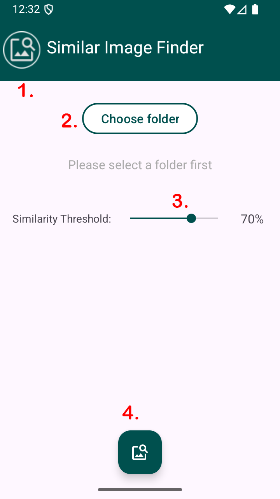
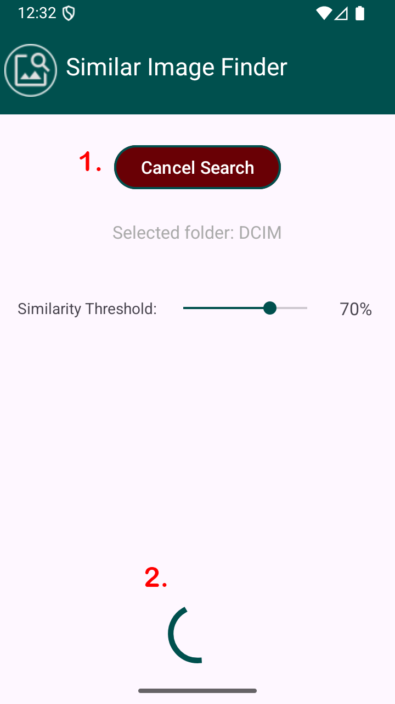
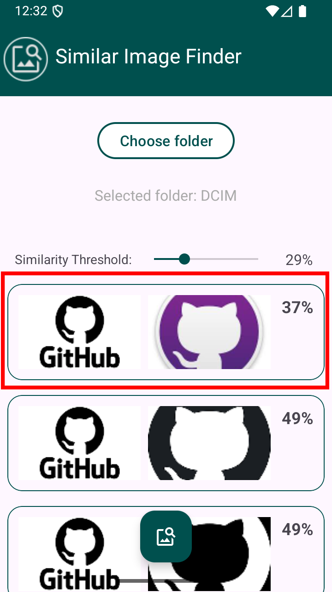
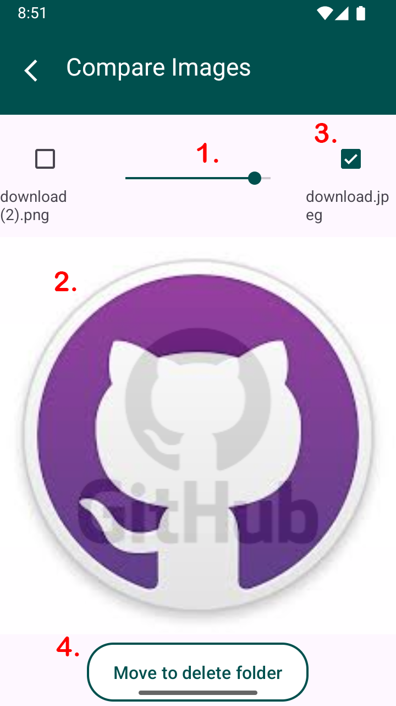

# Similar Image Finder (SIF)

Similar Image Finder (SIF) is a privacy-friendly Android application that helps users identify and review visually similar images within a selected folder. Using perceptual hashing (pHash), the app compares image pairs based on user-defined similarity thresholds, making it easy to sort out duplicate or near-duplicate photos.

**All image comparisons are performed locally – no data leaves your device.**

If you like my app you can [buy me a coffee ☕](https://www.paypal.com/donate?hosted_button_id=VKXH39U9NER9W)

## ✨ Features

- 🔍 **Search for similar images**: Choose a folder to scan for images (subfolders are excluded).
- 🎚 **Set Similarity Threshold:** Define the minimum similarity (e.g., 70%) for image comparisons.
- 👁 **Compare Pairs Easily:** View similar image pairs with:
  - Overlay slider to fade between images
  - Tap to switch between them
- ✅ **Mark Unwanted Images:** Select images you wish to discard using checkboxes.
- 📂 **Safe Deletion Workflow:** Marked images are moved to a subfolder named `delete`
    - 🚫 The app does not permanently delete files (manual cleanup by user)

## 🧭 How to Use

<table>
  <tr>
    <td>
      
    </td>
    <td style="vertical-align: top; padding-left: 20px;">
      <strong>Step 1.</strong> Link to my GitHub Page 😄  
      <strong>Step 2.</strong> Choose a folder containing at least 2 images  
      <strong>Step 3.</strong> Set the similarity threshold  
      <strong>Step 4.</strong> Start the search
    </td>
  </tr>
</table>
 
 --- 

<table>
  <tr>
    <td>
      
    </td>
    <td style="vertical-align: top; padding-left: 20px;">
      <strong>Step 1.</strong> Cancel search, if needed  
      <strong>Step 2.</strong> Wait for the search process to finish  
    </td>
  </tr>
</table>

 --- 

<table>
  <tr>
    <td>
      
    </td>
    <td style="vertical-align: top; padding-left: 20px;">
      Click on the results to open the compare screen  
    </td>
  </tr>
</table>

 --- 

<table>
  <tr>
    <td>
      
    </td>
    <td style="vertical-align: top; padding-left: 20px;">
      <strong>Step 1.</strong> Use the slider to overlay images  
      <strong>Step 2.</strong> Select the checkboxe of the image you want to move to the delete folder  
      <strong>Step 3.</strong> Tap on the image to toggle between the images  
      <strong>Step 4.</strong> Tap on the button to move the selected image(s) to the delete folder  
    </td>
  </tr>
</table>

## 📥 Download

- [Github](https://github.com/otaltan/SimilarImageFinder/releases/tag/v1.0)

## 🔒 Permissions

SIF only requests the minimum necessary permissions:
- **File access**: To read images from user-selected folders and move files.
- **Notifications** *(optional)*: To provide feedback during longer operations.

## 📄 License

This app is licensed under the **GNU GPL v3.0**.  
You are free to use, modify, and distribute it as long as:

- The source code remains available
- Any changes are published under the same license
- Original authors are credited

See [LICENSE](./LICENSE) for details.

## 🙋 Feedback

Found a bug or have a suggestion? Feel free to open an issue.

## Credits
- **Image comparison** inspired by [aetilius/pHash](https://github.com/aetilius/pHash), originally written in C++ and licensed under GPL-3.0.